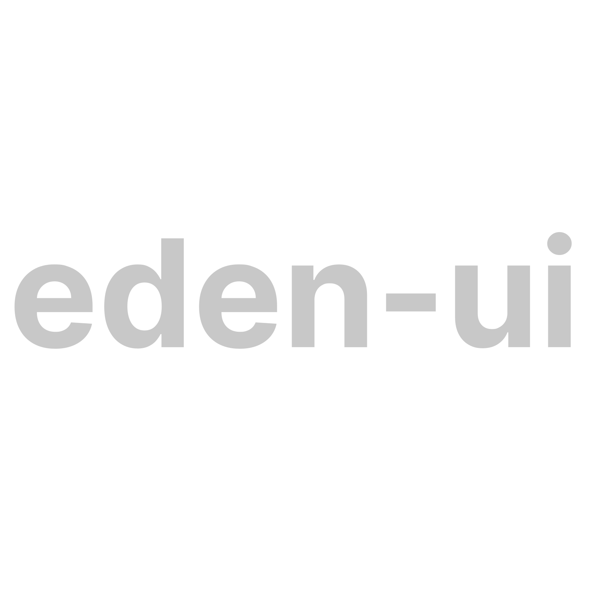

<p align="center">
  <a href="https://github.com/eden-platform/eden-ui">
    
  </a>
</p>
<h1 style="font-size: 24px" align="center">Rapidly build modern frontends for Eden Platform apps</h1>

<p align="center">
  
  
</p>

Eden UI provides a set of components and utilities for rapid UI development.
Components are built using Vue 3 and Tailwind. Along with components, there are
directives and utilities that make UI development easier.

## Links

- [Documentation](https://eden-platform.dpcco.com)

## Installation

```sh
npm install eden-ui
# or
yarn add eden-ui
```

Now, import the EdenUI plugin and components in your Vue app's `main.js`:

```js
import { createApp } from 'vue'
import { EdenUI } from 'eden-ui'
import App from './App.vue'
import './index.css'

let app = createApp(App)
app.use(EdenUI)
app.mount('#app')
```

In your `tailwind.config.js` file, include the eden-ui preset:

```js
module.exports = {
  presets: [
    require('eden-ui/src/utils/tailwind.config')
  ],
  ...
}
```

Now, you can import needed components and start using it:

```html
<template>
  <button>Click me</button>
</template>
<script>
  import { Button } from 'eden-ui'
  export default {
    components: {
      Button,
    },
  }
</script>
```

## License

MIT
